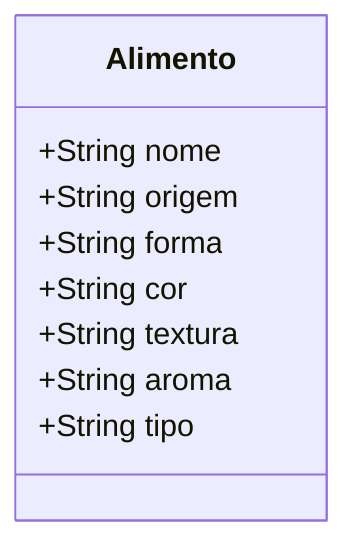
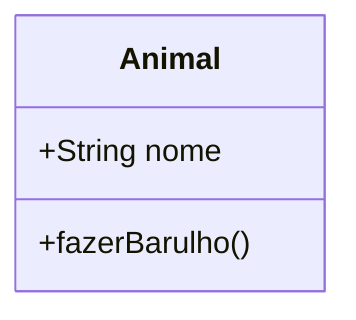
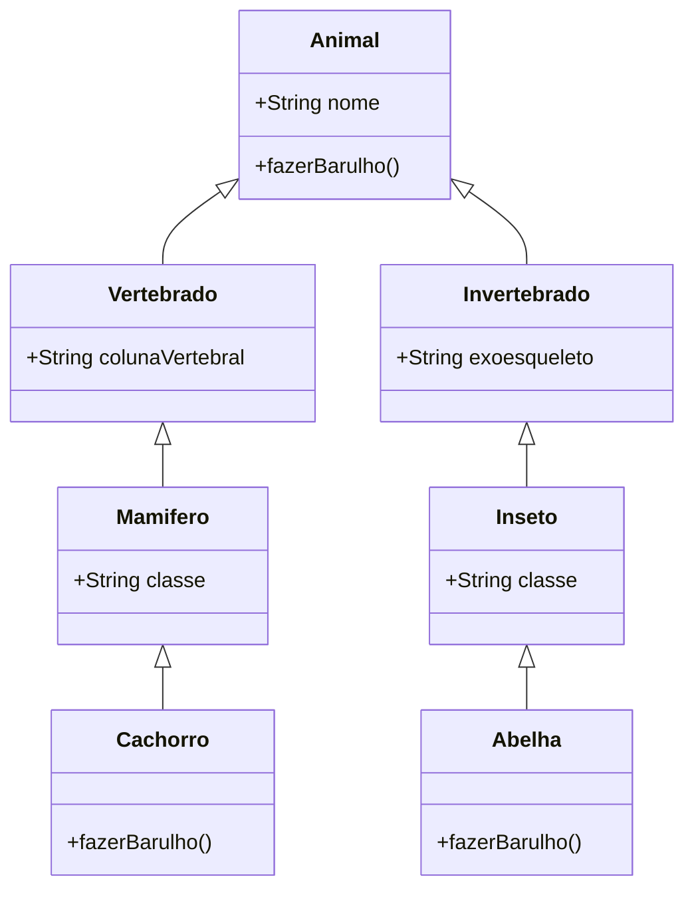
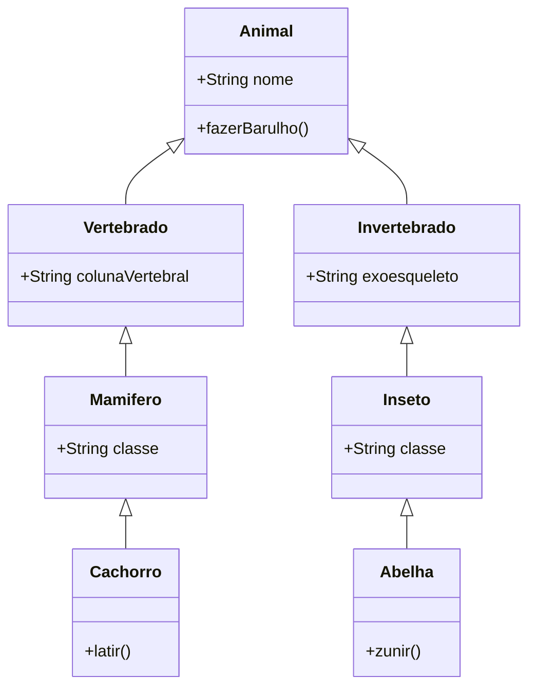
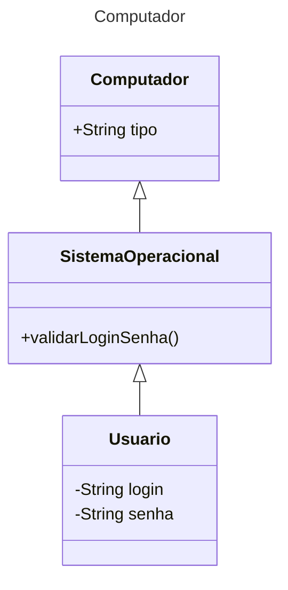

# Programação Orientada a Objetos 

<b>Conteúdo para iniciantes na programação</b>

Definição Básica
: A programação orientada a objetos é a representação abstrata de algo da realidade em um software.

Você está lendo este texto agora através de um dispositivo eletrônico, pode ser um smartphone, pode ser um tablet ou
qualquer outro equipamento.
Estes equipamentos são objetos, são coisas que você pode <b>descrever</b>, e como nós descrevemos algo?
Através dos seguintes sentidos:

- Visão
- Audição
- Tato
- Olfato
- Paladar
    

<p>Mas podemos utilizar os sentidos na programação? Sim, podemos e devemos! Mas de maneira abstrata, não vá lamber o computador.</p>

Visão - O que você vê?
: A visão é o que você vê, o que você enxerga, o que você percebe. Na programação podemos utilizar a visão para
descrever, por exemplo, uma casa.

<p>

</p>
<b>Vamos descrever a imagem da casa, o que você vê?</b>
<p>Eu vejo uma casa, com uma porta, duas janelas, uma chaminé, um telhado, uma parede, uma árvore, uma escada na frente,
uma varanda em volta.
</p>
<p>Podemos perceber a quantidade de coisas que já conseguimos descrever e poderíamos continuar descrevendo coisas e mais coisas
a respeito da casa. A cor das paredes, a cor da chaminé, a textura da chaminé, a cor da janela, etc.</p>

<p><b>Utilizando somente um sentido visão, perceba a quantidade de características conseguimos listar. Se já conseguimos tantas 
informações e podemos conseguir mais por que parar?</b></p>

Tato - Do que é feito?
: Utilizando o tato, podemos entender o que cada parte da casa é feita, como, por exemplo, se eu tocar
nas paredes da casa vou perceber que são feitas de madeira, se eu tocar na chaminé vou perceber que ela é feita de pedra,
se eu tocar nas janelas vou perceber que são feitas de vidro.

A medida que utilizamos nossos sentidos conseguimos descrever cada vez com mais detalhes, da nossa bucólica casa.

A GRANDE QUESTÃO
: <b>Mas seu eu não tivesse a imagem da casa, como eu poderia descrevê-la?</b>

Se você conseguir entender este questionamento mesmo que ainda não saiba a resposta, você está no caminho certo.

## Abstração

Para mim abstração é saber descrever, materializar em nossas mentes algo que existe ou não, ou algo que ainda existirá.
Mas obviamente tenho que trazer o que está escrito nos dicionários.


Abstração
: É simplesmente imaginar, nós estamos imaginando coisas o tempo todo, sejam elas reais ou não. Não vou entrar no campo da filosofia,
poderia, mas não vou, não é isso que temos que fazer agora, precisamos aplicar este conceito para criar algo,
descrever alguma coisa que nem existe ainda.

<p>Não se preocupe, parece que o tema vai se expandir para algo complexo e entendiante, mas não deixarei que isso aconteça.</p>

Mas...

: Não se engane, vamos continuar com o tema <b>abstração</b> o máximo possível, vamos exaustivamente falar sobre <b>abstração</b>, até
que você consiga entender o que é <b>abstração</b> na programação. Ou dizer que não entendeu e que eu sou um péssimo professor. 
Repeti a palavra <b>abstração</b> várias vezes, mas é para você entender que é um conceito importante e que você precisa entender.

Se depois deste tópico você começar a conseguir entender o que é a abstração e como ela impactará toda a sua vida profissional na programação
de softwares, ficarei muito feliz por você, então irei tentar esmiuçar esse conceito da melhor maneira possível.

<p>Vamos continuar utilizando exemplos menos complexos: </p>


<p>Vamos supor que uma artista, uma escultora em rochas de mármore recebeu uma encomenda de um cliente para criar uma 
imagem clássica, de um rosto feminino a partir de um bloco maciço de mármore. Você talvez não consiga ver a escultura pronta, mas
escultora sim. Pode ser que a imagem que o cliente tanto quer já esteja projetada na sua mente e agora ela só precisa de
um martelo, um cinzel e uma lixa para criar o <b>objeto</b> tão desejado.</p>


Pronto, escultura criada cliente satisfeito e dinheiro no bolso. Não existe final feliz melhor que este.

O cliente

: Você pode pensar que a escultura é o fim de todo o processo, mas não é, o cliente satisfeito com a sua escultura
é objetivo, ele fez o pedido, se a artista não tivesse recebido nenhum pedido porque ela faria uma escultura tão trabalhosa?

A rocha maciça

: A rocha em seu estado bruto é a plataforma de criação do objeto, onde a escultura será criada. A partir dela poderia ter sido criada qualquer
tipo de escultura, <b>mas houve um pedido específico do cliente</b> que também depende da habilidade e objetivo da escultura com a sua criação.

A artista

: A detentora de toda a habilidade para criar aquele objeto exatamente ou bem próximo do que o cliente tinha em mente,
ela utilizou todas as suas habilidades para projetar em sua mente uma bela escultura em um bloco de rocha sólido.

O Projeto (esculpir uma escultura)

: Uma mescla da plataforma e das habilidades da artista em 'enxergar' algo que ainda não existe, usando apenas algumas
instruções do cliente para realizar tal trabalho. <b>Estamos chegando em algum lugar com isso</b>

Ações

: Pegar o martelo e cinzel, talhar a rocha, lixar a rocha, todo o ato de esculpir faz parte do projeto de criação deste objeto.

<p>Observando o modelo conceitual na imagem abaixo de todo o processo do cliente desejar ter uma escultura, até o processo
de encomendar para a escultora que tem todos os seus atributos para abstrair e criar o que o cliente tanto deseja, 
a quantidade de informações que precisamos abstrair é muito grande. E parece que para ele dinheiro não é problema.</p>


<tip>Perceba, começamos analisando e entendendo o processo de abstração da escultora em relação a uma estátua que ela
precisava esculpir a partir de uma rocha maciça de mármore. Mas implicitamente ao incluir o cliente que fez esse pedido, foi
preciso pensar em todo o processo de desejo, encomendar, esculpir, entregar e pagar. Poderíamos só nos ater ao processo de esculpir, 
mas fomos além. Defina o foco (escopo) da sua análise, o que fizemos está errado? Não, somente expandimos a abstração pois não 
foi definido um limite de foco.  </tip>

<note><b>DICA! Defina o limite de foco (escopo) da sua abstração, ou as coisas podem 
complicar desnecessariamente.</b></note>

<p>Podemos aplicar o limite de foco(escopo) ao trabalho de abstração e produção da escultora, e vamos fazer isso agora.
Vamos utilizar somente o modelo pré-conceitual para representar toda a abstração que podemos fazer.</p>


<p>Observe o quanto é interessante no processo de abstração limitar o foco(escopo), trouxemos aspectos relevantes do processo
que a escultora realiza para criar sua escultura.</p>

<b>Agora um exemplo mais simples ainda, você com suas habilidades artísticas abra qualquer programa para desenhar e desenhe uma casa. 
Eu também desenharei, só veja o meu desenho depois que você concluir o seu.</b>

#### Minha Casa {collapsible="true"}


`default-state="expanded"`

#### -
<p>Tenho certeza que a sua deve ter ficado bem mais bonita que a minha. Mas note que a partir do exemplo que vimos da casa
anterior conseguimos criar algo que tem similaridade com objeto que já vimos.</p>

E por que conseguimos? Já temos um projeto de uma casa em nossas mentes.

Mais um desafio, desenhe um caminhão, não vou passar nenhuma característica apenas pense e desenhe, deois de desenhar olhe o meu desenho.

#### Meu caminhão {collapsible = "true"}


`default-state="expanded"`

#### -

Mais uma vez tenho certeza que seu desenho ficou melhor que o meu, de fato não sou um artista.

<b>Você sempre terá um desenho, um projeto em sua mente, mesmo que você nem mesmo nunca tenha visto o objeto em si</b>
<p>O caminhão mesmo você não o vendo, sabe que ele tem rodas, vidro, faróis, um baú ou carroceria, portas, e ainda tem a parte mecânica. 
Então temos que nos preparar para a complexidade dos projetos que teremos que produzir.</p>

<note>Os dois desenhos são representações de objetos da realidade, e aí vai uma coisa para você já ir pensando; sabemos para quê uma casa serve e para quê um
caminhão serve. A casa é uma moradia, onde pessoas vivem. Um caminhão é um meio de transporte utilizado para levar de um ponto A até B 
produtos de diversos tipos.<b>(estes dois objetos realizam ações, casa = abrigar pessoas, caminhão = transportar produtos)</b>.</note>

## Levando o conceito de abstração para a programação.

Antes de começar...

: <b>Abstração é a capacidade de imaginar, de materializar algo em nossas mentes, que ainda não existe.</b> Mas nem sempre
é necessário trazer a complexidade do mundo real para o mundo digital, e é aí que entra a <b>abstração na programação</b>.
Em muitos casos precisamos somente de algumas características para representar algo, e não precisamos de todas as características.


A programação orientada a objetos leva a abstração a outro patamar, onde o mundo real é trazido para o mundo digital.

<p>Por exemplo, precisamos representar alimentos, mas não sabemos que tipo de alimentos são. Existem centenas de milhares 
ou até milhões de alimentos diferentes e precisamos criar um projeto que esteja adequado para este trabalho.</p>

<p>É um problemão hein?! Mas vamos lá, não podemos desanimar.</p>

Para começar a criar nosso projeto de representação de alimentos, precisamos criar uma <b>classe Alimento</b> que será o nosso blueprint(projeto), uma estrutura
que vai permitir criar nossos alimentos(objetos), é como se fosse uma incrível fábrica de criar coisas.

Classe

: Uma classe é o projeto(molde) de um objeto, é a partir dela que o objeto recebe todas as características e comportamentos pertencentes a ele.  

Vamos continuar abstraindo;

<p>Se eu preciso criar objetos que são do tipo alimentos eu preciso pensar nas características destes alimentos.
Agora utilizando novamente o poder da abstração vamos utilizar os nossos sentidos e materializar em nossa mente quais 
características os alimentos tem.</p>

Visão
: Alimentos podem ser coloridos ou com cores neutras, podem ser grandes ou muito pequenos, podem ter os mais variados 
formatos, podem estar em cachos, podem ter sido transformados em outros tipos de alimentos. Com visão também podemos ler
o nome do alimento, ler a origem.

Olfato
: Alimentos podem ter os mais diversos cheiros e aromas, podem ter cheiros adocicados, ou cheiros mais cítricos, podem ter vários tipos
de aromas.

Paladar
: Alimentos podem ser doces, salgados, azedos ou amargos ou também podem ser muito secos ou possuir água.

Tato
: Alimentos podem ter vários tipos de texturas, podem estar mais macios ou mais duros. Assim como a visão é possível definir o tamanho,
o formato, e como estão armazenados.

<note>Observe o PCS Pre-conteptual Schema, abaixo que é uma representação de tudo que falamos percebendo as <b>características 
necessárias</b> de Alimento utilizando os sentidos.</note>

<tip>Estamos mantendo um limite de foco(escopo) enxuto, precisamos somente de algumas informações para conseguirmos
identificar e classificar o Alimento que ainda nem sabemos qual é.</tip>


<tip>Eu ainda não falei nenhum nome de alimento, mas utilizando 4 sentidos consigo descrever possíveis 
características de praticamente todos os tipos de alimentos existentes, o que vai me permitir construir objetos da classe 
Alimento mesmo sem saber quais são previamente. ESTE É O PODER DA ABSTRAÇÃO NA PROGRAMAÇÃO.</tip>

### UML - Diagrama de Classe

Já estamos começando a colocar em prática o conceito de abstração na programação, e o diagrama de classe é fundamental
na apresentação de maneira gráfica das classes.

Diagrama de Classe

: O diagrama de classe é uma representação gráfica de uma classe modelo para criação de objetos, utilizado para 
representar uma ou mais classes e os relacionamentos entre si.

Diagrama da classe Alimento


<note><p>Olha só que interessante, acabamos de criar um projeto para criar objetos do tipo Alimento, com apenas uma classe temos um molde dinâmico para 
criar objetos do tipo Alimento com as mais diversas características, imagine se você tivesse que criar uma classe para cada tipo Alimento e sua característica?! Não seria trabalhoso, seria 
impossível... mais uma vez isso é a <b>abstração</b> em ação.</p></note>

<p>Vamos simular o preenchimento em um formulário onde é realizado o cadastro de Alimentos</p>

<b>Cadastro de Alimentos</b>
<table style="header-row" >
<tr>
<th>Características</th>
<th>Descrição</th>
</tr>
<tr>
<th>Nome</th>
<th>Laranja</th>
</tr>
<tr>
<th>Origem</th>
<th>Brasil</th>
</tr>
<tr>
<th>Forma</th>
<th>Redondo</th>
</tr>
<tr>
<th>Cor</th>
<th>Verde</th>
</tr>
<tr>
<th>Textura</th>
<th>Aspera</th>
</tr>
<tr>
<th>Aroma</th>
<th>Cítrico</th>
</tr>
<tr>
<th>Tipo</th>
<th>Fruta</th>
</tr>
</table>

<b>Cadastro de Alimentos</b>
<table style="header-row" >
<tr>
<th>Características</th>
<th>Descrição</th>
</tr>
<tr>
<th>Nome</th>
<th>Pão de Forma</th>
</tr>
<tr>
<th>Origem</th>
<th>Brasil</th>
</tr>
<tr>
<th>Forma</th>
<th>Quadrado</th>
</tr>
<tr>
<th>Cor</th>
<th>Branco</th>
</tr>
<tr>
<th>Textura</th>
<th>Aspero</th>
</tr>
<tr>
<th>Aroma</th>
<th>Panificado</th>
</tr>
<tr>
<th>Tipo</th>
<th>Pão</th>
</tr>
</table>

<note>Com a <b>classe Alimento</b> conseguimos criar objetos de dois tipos de alimentos totalmente diferentes, sem 
sequer sabermos se eles existiam ou não como, por exemplo, laranja e pão usados nos exemplos. Mais uma vez o poder da <b>abstração</b> em ação.</note>

Se você conseguiu entender o que é abstração na programação, que é imaginar e materializar algo em forma de um objeto que tenha
características que sejam úteis para determinado objetivo, você está no caminho certo e podemos continuar nossa jornada, se não 
estiver entendendo volte e leia com mais calma. 

## Herança, Polimorfismo e Encapsulamento

A herança, o polimorfismo, e o encapsulamento são pilares essenciais da programação orientada a objetos, e são conceitos 
importantes para o desenvolvimento de softwares.

Conceito de Herança

: A Herança, sim, é isso mesmo que você está pensando, herdar algo de um familiar, que seriam no caso caracterísitcas dos pais.
Por exemplo, se você tem olhos castanhos, provavelmente seus pais também tem olhos castanhos, e você herdou essa característica deles.
O seu tipo sanguíneo também é uma característica herdada de seus pais ou de seus avós, e assim por diante. Em questão de comportamentos também 
podemos herdar, se você é uma pessoa calma, provavelmente seus pais também são calmos, e você herdou essa característica deles, bem, 
isso não se aplica muito a mim, mas vamos continuar. Na programação orientada a objetos a herança é a capacidade de uma classe 
herdar características de outra classe, ou seja, uma classe filha herda características de uma classe pai. 


Por exemplo, vamos utilizar a classe Animal que será a nossa classe pai, uma superclasse na hierarquia de herança.



<tip>Note que a superclasse Animal tem apenas o atributo nome, mas qualquer clase que herde a característica nome saberemos que ela é 
uma subclasse de animal.</tip>

<p><b>Quais são os sentidos que iremos utilizar para descrever um animal?</b></p>

Visão

: Conseguimos imaginar um animal, um vertebrado que é um mamífero, que é um cachorro, que ao latir faz Au Au. A mesma
coisa valera para um inseto, que é um invertebrado, que é uma abelha, que ao zunir faz Zzz.

Audição

: Conseguimos imaginar o som que um cachorro faz e o som que uma abelha faz.

Veja o exemplo abaixo de como podemos representar a hierarquia de herança de animais:

Atente-se para a hierarquia de herança de animais, onde a classe Animal é a classe pai, e as classes Vertebrado e Invertebrado 
são classes filhas de Animal, e as classes Mamifero e Inseto são classes filhas de Vertebrado e Invertebrado respectivamente,
e as classes Cachorro e Abelha são classes filhas de Mamifero e Inseto respectivamente.



<tip>
<p>Todos os exemplos de código a seguir são apenas para ilustrar o conceito de herança, polimorfismo e encapsulamento, não se preocupe
se não entender o código, o importante é entender o conceito.</p>

<p>Os exemplos de codigo são em Java, mas se você quiser ver os códigos em outras linguagens basta copiar o código e colar em alguma IA
 por exemplo, ChatGPT ou Bard e elas trarão o código na linguagem desejada. <b>Os conhecimentos deste tópico podem ser aplicados a qualquer tipo
de linguagem de programação orientada a objetos e não somente ao Java.</b></p>
</tip>

<p><b>Herança para utilizar a classe cachorro</b></p>

```Java

public class Animal {

    public String nome;
    
    public String fazerBarulho() {
        return "Barulho";
    }
}
```

```Java 

public class Vertebrado extends Animal {

    public String colunaVertebral;
    
}
```

```Java
public class Mamifero extends Vertebrado {

    public String classe;
    
}
```

```Java
public class Cachorro extends Mamifero {

    @Override
    public String fazerBarulho() {
        return "Au Au";
    }
}
```

```Java

Cachorro cachorro = new Cachorro();

System.out.println("Nome do doguinho é " + cachorro.nome);
System.out.println(cachorro.nome + " ao latir faz " + cachorro.latir());
```

```Java
Saída

Nome do doguinho é Rex
Rex ao latir faz Au Au
```

<p><b>Herança para utilizar a classe abelha</b></p>

```Java
public class Animal {

    public String nome;
    
    public String fazerBarulho() {
        return "Barulho";
    }
}
```

```Java
public class Invertebrado extends Animal {

    public String exoesqueleto;
    
}
```
```Java
public class Inseto extends Invertebrado {

    public String classe;
    
}
```
```Java
public class Abelha extends Inseto {

    @Override
    public String fazerBarulho() {
        return "Zzz";
    }
}
```

```Java

Abelha abelha = new Abelha();

System.out.println("Nome da abelhinha é " + abelha.nome);
System.out.println(abelha.nome + " ao zunir faz " + abelha.zunir());
``` 

Saída

: Nome da abelhinha é Zizinha
: Zizinha ao zunir faz Zzz

<note>Perceba que a classe Cachorro herda de Mamifero que herda de Vertebrado que herda de Animal, e a classe Abelha 
herda de Inseto que herda de Invertebrado que herda de Animal. A classe Cachorro possui o método latir() e a classe
Abelha possui o método zunir().</note> 

<tip>Não tínhamos nem o nome e nem o som que cada animal fazia, mas através da abstração, entendemos que iria aparecer algum
animal com essas características</tip>

<tip><b>Agora imagine criar um programa de classificação de todos os animais com suas famílias, Reino, filo, classes, 
ordem, famílias, etc. Está aí um bom desafio.</b></tip>

### Polimorfismo

Polimorfismo (uma palavra derivada do grego que significa "várias formas") é a capacidade de um objeto poder ser referenciado
por mais de um tipo, ou seja, é a capacidade de um objeto poder ser referenciado por uma classe pai e por uma classe filha.



```Java
Animal animal = new Cachorro();
System.out.println("Nome do doguinho é " + animal.nome);
System.out.println(animal.nome + " ao latir faz " + animal.latir());
```
Saída
 
: Nome do doguinho é Rex
: Rex ao latir faz Au Au

```Java
Animal animal = new Abelha();
System.out.println("Nome da abelhinha é " + animal.nome);
System.out.println(animal.nome + " ao zunir faz " + animal.zunir());
``` 

Saída

: Nome da abelhinha é Zizinha
: Zizinha ao zunir faz Zzz

<note>Perceba que o objeto animal foi referenciado por uma classe pai e por uma classe filha, e que o método latir() foi
chamado através da classe pai e o método zunir() foi chamado através da classe filha.</note>

<tip>
O código <code> Animal animal = new Cachorro(); </code> cria um <b>objeto do tipo Cachorro</b> e o referencia através da <b>classe pai Animal</b>.
Isso quer dizer que, o <b>objeto animal é um cachorro</b>, mas ele pode ser <b>referenciado como um animal</b>.
</tip>

<b>Estamos avançando muto bem até aqui, mas é melhor tentar continuar no campo de conceitos até fixarmos bem a ideia de programação orientada a objetos
e seus conceitos básicos. Já apareceu um palavra nova </b>

### Encapsulamento

Encapsulamento é a capacidade de ocultar os detalhes de implementação de um objeto, expondo apenas os métodos de acesso
para que o objeto possa ser utilizado. Um exemplo simples, você não quer saber como seu computador funciona, você só quer ligar e usar, mas também 
não quer que ninguém saiba a senha dele para acessar seus dados que estão armazenados. Pense no computador como um objeto, e a senha como um atributo
privado, que só pode ser acessado através do método de acesso, que no caso é o login. 



Observando o diagrama de classe acima, podemos perceber que o objeto Computador é um SistemaOperacional, e o objeto SistemaOperacional é um Usuario, e o objeto Usuario é um Login.
Com o modelo de esquema pré-conceitual abaixo podemos entender melhor a relação entre as classes.

<p>Em Java utilizamos os métodos get e set para acessar os atributos de uma classe.</p>


```Java

class Animal {
    private String nome;
    
    public String getNome() {
        return nome;
    }
    
    public void setNome(String nome) {
        this.nome = nome;
    }
}
```

```Java

Animal animal = new Cachorro();

animal.setNome("Rex");

System.out.println("Nome do doguinho é " + animal.getNome());
System.out.println(animal.getNome() + " ao latir faz " + animal.latir());
```

Saída

: Nome do doguinho é Rex
: Rex ao latir faz Au Au

```Java
Animal animal = new Abelha();

animal.setNome("Zizinha");

System.out.println("Nome da abelhinha é " + animal.getNome());
System.out.println(animal.getNome() + " ao zunir faz " + animal.zunir());
```

Saída

: Nome da abelhinha é Zizinha
: Zizinha ao zunir faz Zzz

<note>Perceba que o objeto animal foi referenciado por uma classe filha, e que o método latir() foi
chamado através da classe pai e o método zunir() foi chamado através da classe filha.</note>


